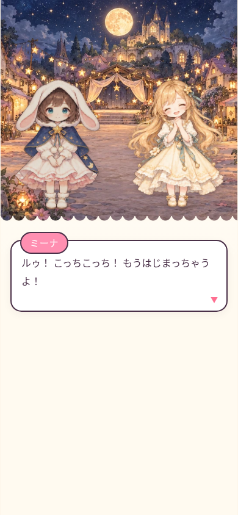

# ルゥと月のこもりうた

声を失った少女ルゥが、おねえちゃんのミーナを探して月へ向かう、タップ操作の物語RPGです。目安は約1時間。スマートフォンの縦・横画面、PCに対応しています。



## 遊び方

リポジトリ全体をダウンロードし、`ルゥと月のこもりうた.html` と `assets/` を同じ場所に置いてください。HTMLをブラウザで開くと遊べます。画像は相対パスで読み込みます。

ローカルサーバーで開く場合は、リポジトリのフォルダで次を実行し、表示されたURLからHTMLを選びます。

```sh
python3 -m http.server 8000
```

会話はタップで進め、戦闘では攻撃・スキル・防御・アイテムを選びます。メェメに日記を書いてもらうとセーブと全回復ができます。以前のバージョンのセーブも同じブラウザ・同じURLで引き継げます。ファイルからサーバーへ移動すると保存先が変わるため、元の保存が自動で移るわけではありません。

ゲーム本体と画像はローカルで動作します。オンライン時はGoogle Fontsを読み込み、取得できない場合は端末のフォントを使います。

## 今回の改善

- キャラクター・敵・全18背景を、水彩とガッシュの絵本調の生成イラストへ更新。主要人物は共通の基準画像から表情差分を制作しました。
- 会話、探索、町の人物一覧、戦闘、仲間アイコン、地図に新画像を組み込みました。本文と選択肢は維持しています。
- 立ち絵の表示枠、敵の予告、人物一覧の列数、戦闘パネル、横画面の配置を調整しました。
- HP装備を外した際の表示、壊れたセーブの読み込み、保存失敗時の誤った成功表示を修正しました。

制作方針と画像一覧は [docs/art-direction.md](docs/art-direction.md)、検証内容は [docs/verification.md](docs/verification.md) に記録しています。

## 開発・検証

Node.jsとChromiumを使用します。

```sh
npm ci
CHROMIUM_PATH=/usr/bin/chromium npm test
```

環境に合わせて`CHROMIUM_PATH`を指定してください。テストには実際のブラウザを使用します。通しプレイのテストだけ、進行確認を短時間で行うため戦闘能力を上げた状態を使います。製品の戦闘能力やバランスは変更していません。

画像を再書き出す場合:

```sh
npm run art:build
```

`assets/source-manifest.json`に切り出し位置を、`assets/reference/`に生成元の画像を保存しています。書き出しツールは透過画像の切り出し・大きさと足元位置の統一・WebP圧縮を行い、HTML内の画像一覧も同期します。画像生成はこのコマンドに含まれません。
